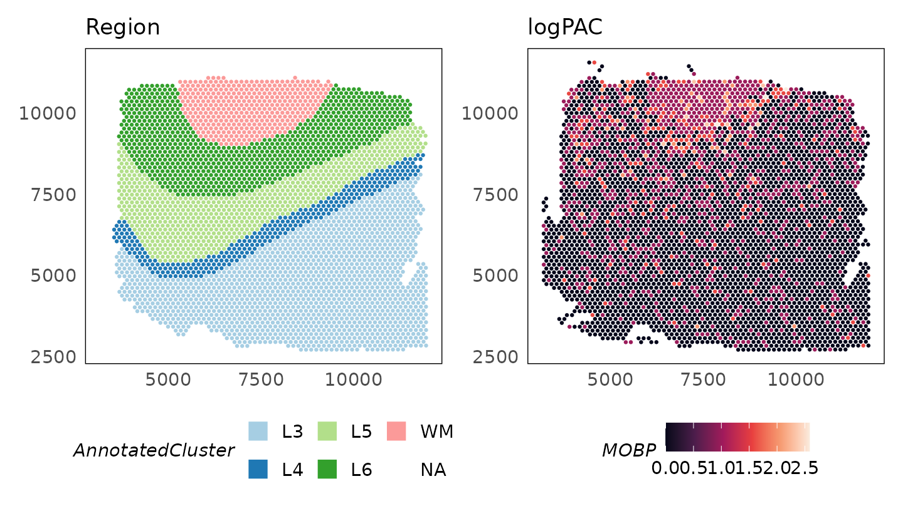
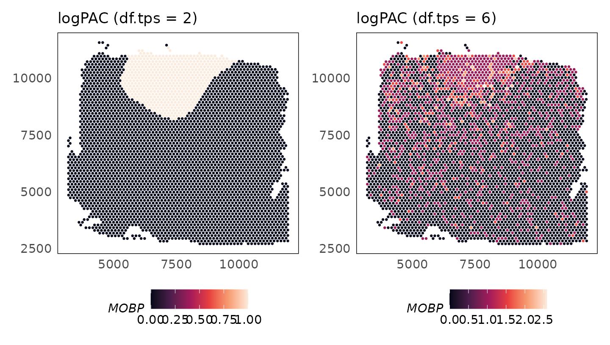
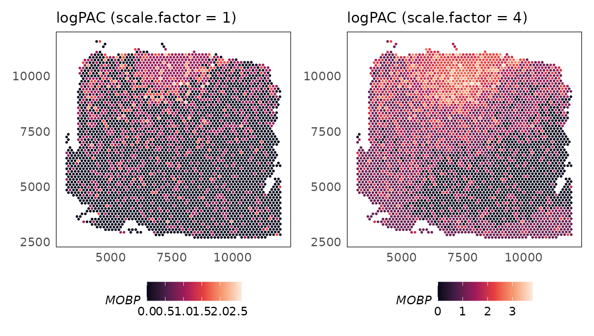
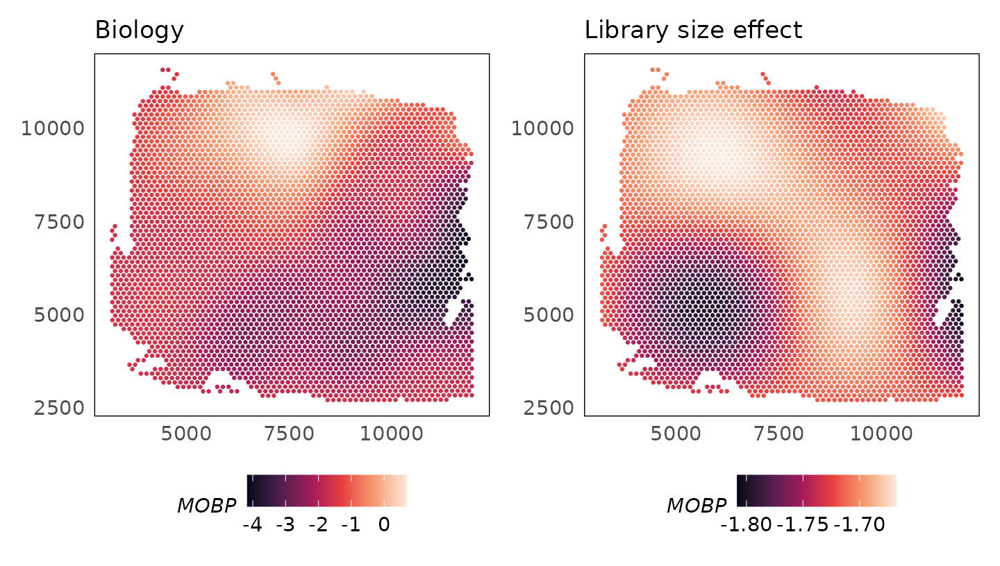
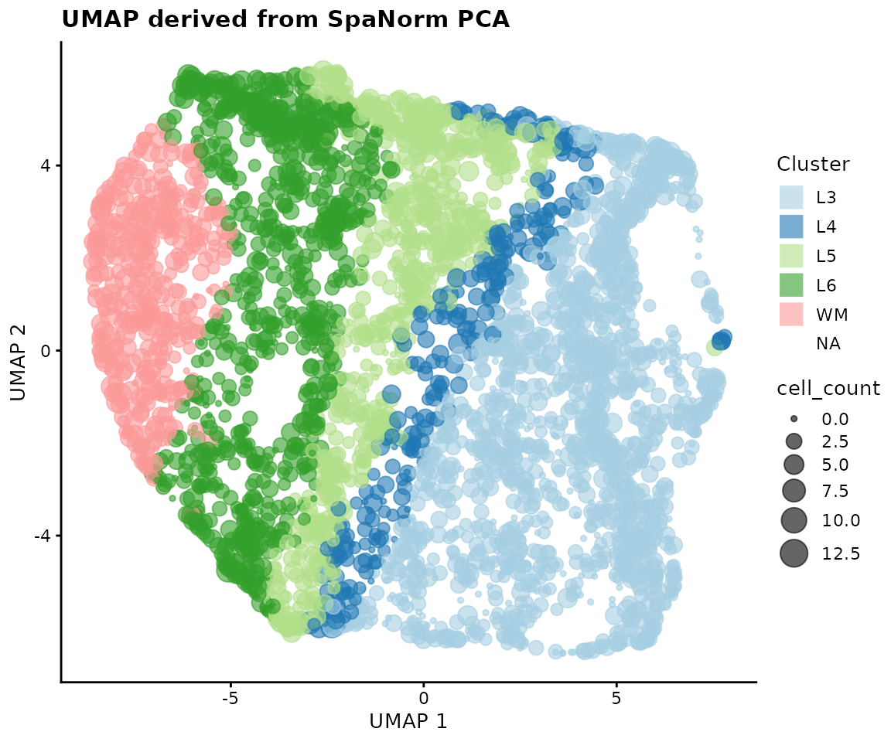

# SpaNorm: Spatially aware library size normalisation

Abstract

This package implements the spatially aware library size normalisation
algorithm, SpaNorm. SpaNorm normalises out library size effects while
retaining biology through the modelling of smooth functions for each
effect. Normalisation is performed in a gene- and cell-/spot- specific
manner, yielding library size adjusted data.

## SpaNorm

SpaNorm is a spatially aware library size normalisation method that
removes library size effects, while retaining biology. Library sizes
need to be removed from molecular datasets to allow comparisons across
observations, in this case, across space. Bhuva et al. (Bhuva et al.
2024) and Atta et al. (Atta et al. 2024) have shown that standard
single-cell inspired library size normalisation approaches are not
appropriate for spatial molecular datasets as they often remove
biological signals while doing so. This is because library size
confounds biology in spatial molecular data.


*The SpaNorm workflow: SpaNorm takes the gene expression data and
spatial coordinates as inputs. Using a gene-wise model (e.g., Negative
Binomial (NB)), SpaNorm decomposes spatially-smooth variation into those
unrelated to library size (LS), representing the underlying true biology
and those related to library size. The adjusted data is then produced by
keeping only the variation unrelated to library size.*

SpaNorm uses a unique approach to spatially constraint modelling
approach to model gene expression (e.g., counts) and remove library size
effects, while retaining biology. It achieves this through three key
innovations:

1.  Optmial decomposition of spatial variation into spatially smooth
    library size associated (technical) and library size independent
    (biology) variation using generalized linear models (GLMs).
2.  Computing spatially smooth functions (using thin plate splines) to
    represent the gene- and location-/cell-/spot- specific size factors.
3.  Adjustment of data using percentile adjusted counts (PAC) (Salim et
    al. 2022), as well as other adjustment approaches (e.g., Pearson).

The SpaNorm package can be installed as follows:

``` r
if (!requireNamespace("BiocManager", quietly = TRUE))
    install.packages("BiocManager")

# release version
BiocManager::install("SpaNorm")
# development version from GitHub
BiocManager::install("bhuvad/SpaNorm")
```

## Load count data

We begin by loading some example 10x Visium data profiling the
dorsolateral prefrontal cortex (DLPFC) of the human brain. The data has
~4,000 spots and covers genome-wide measurements. The example data here
is filtered to remove lowly expressed genes (using
`filterGenes(HumanDLPFC, prop = 0.1)`). This filtering retains genes
that are expressed in at least 10% of cells.

``` r
library(SpaNorm)
library(SpatialExperiment)
library(ggplot2)

# load sample data
data(HumanDLPFC)
# change gene IDs to gene names
rownames(HumanDLPFC) = rowData(HumanDLPFC)$gene_name
HumanDLPFC
#> class: SpatialExperiment 
#> dim: 5076 4015 
#> metadata(0):
#> assays(1): counts
#> rownames(5076): NOC2L HES4 ... MT-CYB AC007325.4
#> rowData names(2): gene_name gene_biotype
#> colnames(4015): AAACAAGTATCTCCCA-1 AAACACCAATAACTGC-1 ...
#>   TTGTTTCCATACAACT-1 TTGTTTGTGTAAATTC-1
#> colData names(3): cell_count sample_id AnnotatedCluster
#> reducedDimNames(0):
#> mainExpName: NULL
#> altExpNames(0):
#> spatialCoords names(2) : pxl_col_in_fullres pxl_row_in_fullres
#> imgData names(4): sample_id image_id data scaleFactor

# plot regions
p_region = plotSpatial(HumanDLPFC, colour = AnnotatedCluster, size = 0.5) +
  scale_colour_brewer(palette = "Paired", guide = guide_legend(override.aes = list(shape = 15, size = 5))) +
  ggtitle("Region")
p_region
```


The `filterGenes` function returns a logical vector indicating which
genes should be kept.

``` r
# filter genes expressed in 20% of spots
keep = filterGenes(HumanDLPFC, 0.2)
table(keep)
#> keep
#> FALSE  TRUE 
#>  2568  2508
# subset genes
HumanDLPFC = HumanDLPFC[keep, ]
```

The log-transformed raw counts are visualised below for the gene *MOBP*
which is a marker of oligodendrocytes enriched in the white matter (WM)
(Maynard et al. 2021). Despite being a marker of this region, we see
that it is in fact absent from the white matter region.

``` r
logcounts(HumanDLPFC) = log2(counts(HumanDLPFC) + 1)

p_counts = plotSpatial(
    HumanDLPFC,
    colour = MOBP,
    what = "expression",
    assay = "logcounts",
    size = 0.5
  ) +
  scale_colour_viridis_c(option = "F") +
  ggtitle("logCounts")
p_region + p_counts
```


## Normalise count data

SpaNorm normalises data in two steps: (1) fitting the SpaNorm model of
library sizes; (2) adjusting data using the fit model. A single call to
the [`SpaNorm()`](https://bhuvad.github.io/spaNorm/reference/SpaNorm.md)
function is enough to run these two steps. To speed up computation, the
model is fit using a smaller proportion of spots/cells (default is
0.25). The can be modified using the `sample.p` parameter.

``` r
set.seed(36)
HumanDLPFC = SpaNorm(HumanDLPFC)
#> (1/2) Fitting SpaNorm model
#> 1004 cells/spots sampled to fit model
#> Hint: To use tensorflow with `py_require()`, call `py_require("tensorflow")` at the start of the R session
#> Hint: To use tensorflow with `py_require()`, call `py_require("tensorflow")` at the start of the R session
#> Hint: To use tensorflow with `py_require()`, call `py_require("tensorflow")` at the start of the R session
#> Hint: To use tensorflow with `py_require()`, call `py_require("tensorflow")` at the start of the R session
#> iter:  1, estimating gene-wise dispersion
#> Hint: To use tensorflow with `py_require()`, call `py_require("tensorflow")` at the start of the R session
#> iter:  1, log-likelihood: -3185991.766198
#> iter:  1, fitting NB model
#> Hint: To use tensorflow with `py_require()`, call `py_require("tensorflow")` at the start of the R session
#> Hint: To use tensorflow with `py_require()`, call `py_require("tensorflow")` at the start of the R session
#> Hint: To use tensorflow with `py_require()`, call `py_require("tensorflow")` at the start of the R session
#> Hint: To use tensorflow with `py_require()`, call `py_require("tensorflow")` at the start of the R session
#> Hint: To use tensorflow with `py_require()`, call `py_require("tensorflow")` at the start of the R session
#> Hint: To use tensorflow with `py_require()`, call `py_require("tensorflow")` at the start of the R session
#> iter:  1, iter:  1, log-likelihood: -3185991.766198
#> Hint: To use tensorflow with `py_require()`, call `py_require("tensorflow")` at the start of the R session
#> Hint: To use tensorflow with `py_require()`, call `py_require("tensorflow")` at the start of the R session
#> Hint: To use tensorflow with `py_require()`, call `py_require("tensorflow")` at the start of the R session
#> Hint: To use tensorflow with `py_require()`, call `py_require("tensorflow")` at the start of the R session
#> Hint: To use tensorflow with `py_require()`, call `py_require("tensorflow")` at the start of the R session
#> Hint: To use tensorflow with `py_require()`, call `py_require("tensorflow")` at the start of the R session
#> Hint: To use tensorflow with `py_require()`, call `py_require("tensorflow")` at the start of the R session
#> Hint: To use tensorflow with `py_require()`, call `py_require("tensorflow")` at the start of the R session
#> Hint: To use tensorflow with `py_require()`, call `py_require("tensorflow")` at the start of the R session
#> Hint: To use tensorflow with `py_require()`, call `py_require("tensorflow")` at the start of the R session
#> Hint: To use tensorflow with `py_require()`, call `py_require("tensorflow")` at the start of the R session
#> Hint: To use tensorflow with `py_require()`, call `py_require("tensorflow")` at the start of the R session
#> Hint: To use tensorflow with `py_require()`, call `py_require("tensorflow")` at the start of the R session
#> Hint: To use tensorflow with `py_require()`, call `py_require("tensorflow")` at the start of the R session
#> Hint: To use tensorflow with `py_require()`, call `py_require("tensorflow")` at the start of the R session
#> iter:  1, iter:  2, log-likelihood: -2582103.888695
#> Hint: To use tensorflow with `py_require()`, call `py_require("tensorflow")` at the start of the R session
#> Hint: To use tensorflow with `py_require()`, call `py_require("tensorflow")` at the start of the R session
#> Hint: To use tensorflow with `py_require()`, call `py_require("tensorflow")` at the start of the R session
#> Hint: To use tensorflow with `py_require()`, call `py_require("tensorflow")` at the start of the R session
#> Hint: To use tensorflow with `py_require()`, call `py_require("tensorflow")` at the start of the R session
#> Hint: To use tensorflow with `py_require()`, call `py_require("tensorflow")` at the start of the R session
#> Hint: To use tensorflow with `py_require()`, call `py_require("tensorflow")` at the start of the R session
#> Hint: To use tensorflow with `py_require()`, call `py_require("tensorflow")` at the start of the R session
#> Hint: To use tensorflow with `py_require()`, call `py_require("tensorflow")` at the start of the R session
#> Hint: To use tensorflow with `py_require()`, call `py_require("tensorflow")` at the start of the R session
#> Hint: To use tensorflow with `py_require()`, call `py_require("tensorflow")` at the start of the R session
#> Hint: To use tensorflow with `py_require()`, call `py_require("tensorflow")` at the start of the R session
#> Hint: To use tensorflow with `py_require()`, call `py_require("tensorflow")` at the start of the R session
#> Hint: To use tensorflow with `py_require()`, call `py_require("tensorflow")` at the start of the R session
#> Hint: To use tensorflow with `py_require()`, call `py_require("tensorflow")` at the start of the R session
#> iter:  1, iter:  3, log-likelihood: -2463315.785705
#> Hint: To use tensorflow with `py_require()`, call `py_require("tensorflow")` at the start of the R session
#> Hint: To use tensorflow with `py_require()`, call `py_require("tensorflow")` at the start of the R session
#> Hint: To use tensorflow with `py_require()`, call `py_require("tensorflow")` at the start of the R session
#> Hint: To use tensorflow with `py_require()`, call `py_require("tensorflow")` at the start of the R session
#> Hint: To use tensorflow with `py_require()`, call `py_require("tensorflow")` at the start of the R session
#> Hint: To use tensorflow with `py_require()`, call `py_require("tensorflow")` at the start of the R session
#> Hint: To use tensorflow with `py_require()`, call `py_require("tensorflow")` at the start of the R session
#> Hint: To use tensorflow with `py_require()`, call `py_require("tensorflow")` at the start of the R session
#> Hint: To use tensorflow with `py_require()`, call `py_require("tensorflow")` at the start of the R session
#> Hint: To use tensorflow with `py_require()`, call `py_require("tensorflow")` at the start of the R session
#> Hint: To use tensorflow with `py_require()`, call `py_require("tensorflow")` at the start of the R session
#> Hint: To use tensorflow with `py_require()`, call `py_require("tensorflow")` at the start of the R session
#> Hint: To use tensorflow with `py_require()`, call `py_require("tensorflow")` at the start of the R session
#> Hint: To use tensorflow with `py_require()`, call `py_require("tensorflow")` at the start of the R session
#> Hint: To use tensorflow with `py_require()`, call `py_require("tensorflow")` at the start of the R session
#> iter:  1, iter:  4, log-likelihood: -2425458.605075
#> Hint: To use tensorflow with `py_require()`, call `py_require("tensorflow")` at the start of the R session
#> Hint: To use tensorflow with `py_require()`, call `py_require("tensorflow")` at the start of the R session
#> Hint: To use tensorflow with `py_require()`, call `py_require("tensorflow")` at the start of the R session
#> Hint: To use tensorflow with `py_require()`, call `py_require("tensorflow")` at the start of the R session
#> Hint: To use tensorflow with `py_require()`, call `py_require("tensorflow")` at the start of the R session
#> Hint: To use tensorflow with `py_require()`, call `py_require("tensorflow")` at the start of the R session
#> Hint: To use tensorflow with `py_require()`, call `py_require("tensorflow")` at the start of the R session
#> Hint: To use tensorflow with `py_require()`, call `py_require("tensorflow")` at the start of the R session
#> Hint: To use tensorflow with `py_require()`, call `py_require("tensorflow")` at the start of the R session
#> Hint: To use tensorflow with `py_require()`, call `py_require("tensorflow")` at the start of the R session
#> Hint: To use tensorflow with `py_require()`, call `py_require("tensorflow")` at the start of the R session
#> Hint: To use tensorflow with `py_require()`, call `py_require("tensorflow")` at the start of the R session
#> Hint: To use tensorflow with `py_require()`, call `py_require("tensorflow")` at the start of the R session
#> Hint: To use tensorflow with `py_require()`, call `py_require("tensorflow")` at the start of the R session
#> Hint: To use tensorflow with `py_require()`, call `py_require("tensorflow")` at the start of the R session
#> iter:  1, iter:  5, log-likelihood: -2411619.260732
#> Hint: To use tensorflow with `py_require()`, call `py_require("tensorflow")` at the start of the R session
#> Hint: To use tensorflow with `py_require()`, call `py_require("tensorflow")` at the start of the R session
#> Hint: To use tensorflow with `py_require()`, call `py_require("tensorflow")` at the start of the R session
#> Hint: To use tensorflow with `py_require()`, call `py_require("tensorflow")` at the start of the R session
#> Hint: To use tensorflow with `py_require()`, call `py_require("tensorflow")` at the start of the R session
#> Hint: To use tensorflow with `py_require()`, call `py_require("tensorflow")` at the start of the R session
#> Hint: To use tensorflow with `py_require()`, call `py_require("tensorflow")` at the start of the R session
#> Hint: To use tensorflow with `py_require()`, call `py_require("tensorflow")` at the start of the R session
#> Hint: To use tensorflow with `py_require()`, call `py_require("tensorflow")` at the start of the R session
#> Hint: To use tensorflow with `py_require()`, call `py_require("tensorflow")` at the start of the R session
#> Hint: To use tensorflow with `py_require()`, call `py_require("tensorflow")` at the start of the R session
#> Hint: To use tensorflow with `py_require()`, call `py_require("tensorflow")` at the start of the R session
#> Hint: To use tensorflow with `py_require()`, call `py_require("tensorflow")` at the start of the R session
#> Hint: To use tensorflow with `py_require()`, call `py_require("tensorflow")` at the start of the R session
#> Hint: To use tensorflow with `py_require()`, call `py_require("tensorflow")` at the start of the R session
#> iter:  1, iter:  6, log-likelihood: -2407711.960028
#> Hint: To use tensorflow with `py_require()`, call `py_require("tensorflow")` at the start of the R session
#> Hint: To use tensorflow with `py_require()`, call `py_require("tensorflow")` at the start of the R session
#> Hint: To use tensorflow with `py_require()`, call `py_require("tensorflow")` at the start of the R session
#> Hint: To use tensorflow with `py_require()`, call `py_require("tensorflow")` at the start of the R session
#> Hint: To use tensorflow with `py_require()`, call `py_require("tensorflow")` at the start of the R session
#> Hint: To use tensorflow with `py_require()`, call `py_require("tensorflow")` at the start of the R session
#> Hint: To use tensorflow with `py_require()`, call `py_require("tensorflow")` at the start of the R session
#> Hint: To use tensorflow with `py_require()`, call `py_require("tensorflow")` at the start of the R session
#> Hint: To use tensorflow with `py_require()`, call `py_require("tensorflow")` at the start of the R session
#> Hint: To use tensorflow with `py_require()`, call `py_require("tensorflow")` at the start of the R session
#> Hint: To use tensorflow with `py_require()`, call `py_require("tensorflow")` at the start of the R session
#> Hint: To use tensorflow with `py_require()`, call `py_require("tensorflow")` at the start of the R session
#> Hint: To use tensorflow with `py_require()`, call `py_require("tensorflow")` at the start of the R session
#> Hint: To use tensorflow with `py_require()`, call `py_require("tensorflow")` at the start of the R session
#> Hint: To use tensorflow with `py_require()`, call `py_require("tensorflow")` at the start of the R session
#> iter:  1, iter:  7, log-likelihood: -2406494.322919
#> Hint: To use tensorflow with `py_require()`, call `py_require("tensorflow")` at the start of the R session
#> Hint: To use tensorflow with `py_require()`, call `py_require("tensorflow")` at the start of the R session
#> Hint: To use tensorflow with `py_require()`, call `py_require("tensorflow")` at the start of the R session
#> Hint: To use tensorflow with `py_require()`, call `py_require("tensorflow")` at the start of the R session
#> Hint: To use tensorflow with `py_require()`, call `py_require("tensorflow")` at the start of the R session
#> Hint: To use tensorflow with `py_require()`, call `py_require("tensorflow")` at the start of the R session
#> Hint: To use tensorflow with `py_require()`, call `py_require("tensorflow")` at the start of the R session
#> Hint: To use tensorflow with `py_require()`, call `py_require("tensorflow")` at the start of the R session
#> Hint: To use tensorflow with `py_require()`, call `py_require("tensorflow")` at the start of the R session
#> Hint: To use tensorflow with `py_require()`, call `py_require("tensorflow")` at the start of the R session
#> Hint: To use tensorflow with `py_require()`, call `py_require("tensorflow")` at the start of the R session
#> Hint: To use tensorflow with `py_require()`, call `py_require("tensorflow")` at the start of the R session
#> Hint: To use tensorflow with `py_require()`, call `py_require("tensorflow")` at the start of the R session
#> Hint: To use tensorflow with `py_require()`, call `py_require("tensorflow")` at the start of the R session
#> Hint: To use tensorflow with `py_require()`, call `py_require("tensorflow")` at the start of the R session
#> iter:  1, iter:  8, log-likelihood: -2406052.089545
#> Hint: To use tensorflow with `py_require()`, call `py_require("tensorflow")` at the start of the R session
#> Hint: To use tensorflow with `py_require()`, call `py_require("tensorflow")` at the start of the R session
#> Hint: To use tensorflow with `py_require()`, call `py_require("tensorflow")` at the start of the R session
#> Hint: To use tensorflow with `py_require()`, call `py_require("tensorflow")` at the start of the R session
#> Hint: To use tensorflow with `py_require()`, call `py_require("tensorflow")` at the start of the R session
#> Hint: To use tensorflow with `py_require()`, call `py_require("tensorflow")` at the start of the R session
#> Hint: To use tensorflow with `py_require()`, call `py_require("tensorflow")` at the start of the R session
#> Hint: To use tensorflow with `py_require()`, call `py_require("tensorflow")` at the start of the R session
#> Hint: To use tensorflow with `py_require()`, call `py_require("tensorflow")` at the start of the R session
#> Hint: To use tensorflow with `py_require()`, call `py_require("tensorflow")` at the start of the R session
#> Hint: To use tensorflow with `py_require()`, call `py_require("tensorflow")` at the start of the R session
#> Hint: To use tensorflow with `py_require()`, call `py_require("tensorflow")` at the start of the R session
#> Hint: To use tensorflow with `py_require()`, call `py_require("tensorflow")` at the start of the R session
#> Hint: To use tensorflow with `py_require()`, call `py_require("tensorflow")` at the start of the R session
#> Hint: To use tensorflow with `py_require()`, call `py_require("tensorflow")` at the start of the R session
#> iter:  1, iter:  9, log-likelihood: -2405875.012540 (converged)
#> iter:  2, estimating gene-wise dispersion
#> Hint: To use tensorflow with `py_require()`, call `py_require("tensorflow")` at the start of the R session
#> iter:  2, log-likelihood: -2402618.503945
#> iter:  2, fitting NB model
#> Hint: To use tensorflow with `py_require()`, call `py_require("tensorflow")` at the start of the R session
#> Hint: To use tensorflow with `py_require()`, call `py_require("tensorflow")` at the start of the R session
#> Hint: To use tensorflow with `py_require()`, call `py_require("tensorflow")` at the start of the R session
#> Hint: To use tensorflow with `py_require()`, call `py_require("tensorflow")` at the start of the R session
#> Hint: To use tensorflow with `py_require()`, call `py_require("tensorflow")` at the start of the R session
#> Hint: To use tensorflow with `py_require()`, call `py_require("tensorflow")` at the start of the R session
#> iter:  2, iter:  1, log-likelihood: -2402618.503945
#> Hint: To use tensorflow with `py_require()`, call `py_require("tensorflow")` at the start of the R session
#> Hint: To use tensorflow with `py_require()`, call `py_require("tensorflow")` at the start of the R session
#> Hint: To use tensorflow with `py_require()`, call `py_require("tensorflow")` at the start of the R session
#> Hint: To use tensorflow with `py_require()`, call `py_require("tensorflow")` at the start of the R session
#> Hint: To use tensorflow with `py_require()`, call `py_require("tensorflow")` at the start of the R session
#> Hint: To use tensorflow with `py_require()`, call `py_require("tensorflow")` at the start of the R session
#> Hint: To use tensorflow with `py_require()`, call `py_require("tensorflow")` at the start of the R session
#> Hint: To use tensorflow with `py_require()`, call `py_require("tensorflow")` at the start of the R session
#> Hint: To use tensorflow with `py_require()`, call `py_require("tensorflow")` at the start of the R session
#> Hint: To use tensorflow with `py_require()`, call `py_require("tensorflow")` at the start of the R session
#> Hint: To use tensorflow with `py_require()`, call `py_require("tensorflow")` at the start of the R session
#> Hint: To use tensorflow with `py_require()`, call `py_require("tensorflow")` at the start of the R session
#> Hint: To use tensorflow with `py_require()`, call `py_require("tensorflow")` at the start of the R session
#> Hint: To use tensorflow with `py_require()`, call `py_require("tensorflow")` at the start of the R session
#> Hint: To use tensorflow with `py_require()`, call `py_require("tensorflow")` at the start of the R session
#> iter:  2, iter:  2, log-likelihood: -2401826.557195
#> Hint: To use tensorflow with `py_require()`, call `py_require("tensorflow")` at the start of the R session
#> Hint: To use tensorflow with `py_require()`, call `py_require("tensorflow")` at the start of the R session
#> Hint: To use tensorflow with `py_require()`, call `py_require("tensorflow")` at the start of the R session
#> Hint: To use tensorflow with `py_require()`, call `py_require("tensorflow")` at the start of the R session
#> Hint: To use tensorflow with `py_require()`, call `py_require("tensorflow")` at the start of the R session
#> Hint: To use tensorflow with `py_require()`, call `py_require("tensorflow")` at the start of the R session
#> Hint: To use tensorflow with `py_require()`, call `py_require("tensorflow")` at the start of the R session
#> Hint: To use tensorflow with `py_require()`, call `py_require("tensorflow")` at the start of the R session
#> Hint: To use tensorflow with `py_require()`, call `py_require("tensorflow")` at the start of the R session
#> Hint: To use tensorflow with `py_require()`, call `py_require("tensorflow")` at the start of the R session
#> Hint: To use tensorflow with `py_require()`, call `py_require("tensorflow")` at the start of the R session
#> Hint: To use tensorflow with `py_require()`, call `py_require("tensorflow")` at the start of the R session
#> Hint: To use tensorflow with `py_require()`, call `py_require("tensorflow")` at the start of the R session
#> Hint: To use tensorflow with `py_require()`, call `py_require("tensorflow")` at the start of the R session
#> Hint: To use tensorflow with `py_require()`, call `py_require("tensorflow")` at the start of the R session
#> iter:  2, iter:  3, log-likelihood: -2401754.435364 (converged)
#> iter:  3, estimating gene-wise dispersion
#> Hint: To use tensorflow with `py_require()`, call `py_require("tensorflow")` at the start of the R session
#> iter:  3, log-likelihood: -2401744.259596
#> iter:  3, fitting NB model
#> Hint: To use tensorflow with `py_require()`, call `py_require("tensorflow")` at the start of the R session
#> Hint: To use tensorflow with `py_require()`, call `py_require("tensorflow")` at the start of the R session
#> Hint: To use tensorflow with `py_require()`, call `py_require("tensorflow")` at the start of the R session
#> Hint: To use tensorflow with `py_require()`, call `py_require("tensorflow")` at the start of the R session
#> Hint: To use tensorflow with `py_require()`, call `py_require("tensorflow")` at the start of the R session
#> Hint: To use tensorflow with `py_require()`, call `py_require("tensorflow")` at the start of the R session
#> iter:  3, iter:  1, log-likelihood: -2401744.259596
#> Hint: To use tensorflow with `py_require()`, call `py_require("tensorflow")` at the start of the R session
#> Hint: To use tensorflow with `py_require()`, call `py_require("tensorflow")` at the start of the R session
#> Hint: To use tensorflow with `py_require()`, call `py_require("tensorflow")` at the start of the R session
#> Hint: To use tensorflow with `py_require()`, call `py_require("tensorflow")` at the start of the R session
#> Hint: To use tensorflow with `py_require()`, call `py_require("tensorflow")` at the start of the R session
#> Hint: To use tensorflow with `py_require()`, call `py_require("tensorflow")` at the start of the R session
#> Hint: To use tensorflow with `py_require()`, call `py_require("tensorflow")` at the start of the R session
#> Hint: To use tensorflow with `py_require()`, call `py_require("tensorflow")` at the start of the R session
#> Hint: To use tensorflow with `py_require()`, call `py_require("tensorflow")` at the start of the R session
#> Hint: To use tensorflow with `py_require()`, call `py_require("tensorflow")` at the start of the R session
#> Hint: To use tensorflow with `py_require()`, call `py_require("tensorflow")` at the start of the R session
#> Hint: To use tensorflow with `py_require()`, call `py_require("tensorflow")` at the start of the R session
#> Hint: To use tensorflow with `py_require()`, call `py_require("tensorflow")` at the start of the R session
#> Hint: To use tensorflow with `py_require()`, call `py_require("tensorflow")` at the start of the R session
#> Hint: To use tensorflow with `py_require()`, call `py_require("tensorflow")` at the start of the R session
#> iter:  3, iter:  2, log-likelihood: -2401695.995571
#> Hint: To use tensorflow with `py_require()`, call `py_require("tensorflow")` at the start of the R session
#> Hint: To use tensorflow with `py_require()`, call `py_require("tensorflow")` at the start of the R session
#> Hint: To use tensorflow with `py_require()`, call `py_require("tensorflow")` at the start of the R session
#> Hint: To use tensorflow with `py_require()`, call `py_require("tensorflow")` at the start of the R session
#> Hint: To use tensorflow with `py_require()`, call `py_require("tensorflow")` at the start of the R session
#> Hint: To use tensorflow with `py_require()`, call `py_require("tensorflow")` at the start of the R session
#> Hint: To use tensorflow with `py_require()`, call `py_require("tensorflow")` at the start of the R session
#> Hint: To use tensorflow with `py_require()`, call `py_require("tensorflow")` at the start of the R session
#> Hint: To use tensorflow with `py_require()`, call `py_require("tensorflow")` at the start of the R session
#> Hint: To use tensorflow with `py_require()`, call `py_require("tensorflow")` at the start of the R session
#> Hint: To use tensorflow with `py_require()`, call `py_require("tensorflow")` at the start of the R session
#> Hint: To use tensorflow with `py_require()`, call `py_require("tensorflow")` at the start of the R session
#> Hint: To use tensorflow with `py_require()`, call `py_require("tensorflow")` at the start of the R session
#> Hint: To use tensorflow with `py_require()`, call `py_require("tensorflow")` at the start of the R session
#> Hint: To use tensorflow with `py_require()`, call `py_require("tensorflow")` at the start of the R session
#> iter:  3, iter:  3, log-likelihood: -2401686.415779 (converged)
#> iter:  4, log-likelihood: -2401686.415779 (converged)
#> (2/2) Normalising data
HumanDLPFC
#> class: SpatialExperiment 
#> dim: 2508 4015 
#> metadata(1): SpaNorm
#> assays(2): counts logcounts
#> rownames(2508): ISG15 SDF4 ... MT-ND6 MT-CYB
#> rowData names(2): gene_name gene_biotype
#> colnames(4015): AAACAAGTATCTCCCA-1 AAACACCAATAACTGC-1 ...
#>   TTGTTTCCATACAACT-1 TTGTTTGTGTAAATTC-1
#> colData names(3): cell_count sample_id AnnotatedCluster
#> reducedDimNames(0):
#> mainExpName: NULL
#> altExpNames(0):
#> spatialCoords names(2) : pxl_col_in_fullres pxl_row_in_fullres
#> imgData names(4): sample_id image_id data scaleFactor
```

The above output (which can be switched off by setting
`verbose = FALSE`), shows the two steps of normalisation. In the model
fitting step, 1004 cells/spots are used to fit the negative binomial
(NB) model. Subsequent output shows that this fit is performed by
alternating between estimation of the dispersion parameter and
estimation of the NB parameters by fixing the dispersion. The output
also shows that each intermediate fit converges, and so does the final
fit. The accuracy of the fit can be controlled by modifying the
tolerance parameter `tol` (default `1e-4`).

Next, data is adjusted using the fit model. The following approaches are
implemented for count data:

1.  `adj.method = "logpac"` (default) - percentile adjusted counts (PAC)
    which estimates the count for each gene at each location/spot/cell
    using a model that does not contain unwanted effects such as the
    library size.
2.  `adj.method = "person"` - Pearson residuals from factoring out
    unwanted effects.
3.  `adj.method = "meanbio"` - the mean of each gene at each location
    estimated from the biological component of the model.
4.  `adj.method = "medbio"` - the median of each gene at each location
    estimated from the biological component of the model.

These data are stored in the `logcounts` assay of the SpatialExperiment
object. After normalisation, we see that MOBP is enriched in the white
matter.

``` r
p_logpac = plotSpatial(
    HumanDLPFC,
    colour = MOBP,
    what = "expression",
    assay = "logcounts",
    size = 0.5
  ) +
  scale_colour_viridis_c(option = "F") +
  ggtitle("logPAC")
p_region + p_logpac
```



## Using Seurat objects

Users may prefer to work with Seurat. Below we convert the
`SpatialExperiment` object to Seurat (v5) and add spatial coordinates
extracted from the original `SpatialExperiment`. The SpaNorm function
can then be run directly on the Seurat object. Note that the `counts`
assay is used to store raw counts and the `data` assay is used to store
normalised values, following Seurat conventions. SpaNorm searches for
coordinates in the `images` slot which contains the `coordinates` slot.
If not found, it will also search `meta.data` slot of the Seurat object
with names `x` and `y`, or with names `imagecol` and `imagerow`. This is
the order of the search of coordinates

``` r
library(Seurat)

# create a Seurat object with the data
seurat_obj = HumanDLPFC
logcounts(seurat_obj) = counts(seurat_obj)
seurat_obj = suppressWarnings(Seurat::as.Seurat(seurat_obj))  
# add spatial coordinates to Seurat meta.data from SpatialExperiment
coords = SpatialExperiment::spatialCoords(HumanDLPFC)
seurat_obj@meta.data$x = coords[, 1]
seurat_obj@meta.data$y = coords[, 2]

# run SpaNorm on Seurat (CPU backend)
seurat_obj <- SpaNorm(seurat_obj, sample.p = 0.1, df.tps = 2, backend = "cpu", verbose = TRUE)
seurat_obj
#> An object of class Seurat 
#> 2508 features across 4015 samples within 1 assay 
#> Active assay: originalexp (2508 features, 0 variable features)
#>  2 layers present: counts, data
```

## Computing alternative adjustments using a precomputed SpaNorm fit

As no appropriate slot exists for storing model parameters, we currently
save them in the metadata slot with the name “SpaNorm”. This also means
that subsetting features (i.e., genes) or observations (i.e.,
cells/spots/loci) does not subset the model. In such an instance, the
SpaNorm function will realise that the model no longer matches the data
and re-estimates when called. If instead the model is valid for the
data, the existing fit is extracted and reused.

The fit can be manually retrieved as below for users wishing to reuse
the model outside the SpaNorm framework. Otherwise, calling
[`SpaNorm()`](https://bhuvad.github.io/spaNorm/reference/SpaNorm.md) on
an object containing the fit will automatically use it.

``` r
# manually retrieve model
fit.spanorm = metadata(HumanDLPFC)$SpaNorm
fit.spanorm
#> SpaNormFit
#> Data: 2508 genes, 4015 cells/spots
#> Gene model: nb
#> Degrees of freedom for TPS (y,x): Biology (6,6), LS (3,3)
#> Spots/cells sampled: 25%
#> Regularisation parameter: Biology (1e-04), LS (1e-04)
#> Batch:  NULL
#> log-likelihood (per-iteration):  num [1:3] -2405875 -2401754 -2401686
#> W:  num [1:4015, 1:46] 0.2645 0.4736 0.0547 -0.1756 0.6039 ...
#> W:  - attr(*, "dimnames")=List of 2
#> W:   ..$ : chr [1:4015] "1" "2" "3" "4" ...
#> W:   ..$ : chr [1:46] "logLS" "bs.xy.bio1" "bs.xy.bio2" "bs.xy.bio3" ...
#> alpha:  num [1:2508, 1:46] 0.989 0.989 0.989 0.989 0.989 ...
#> gmean:  num [1:2508] -1.307 -1.193 -1.275 -1.445 -0.399 ...
#> psi:  num [1:2508] 0.0399 0.0409 0.04 0.0385 0.0348 ...
#> wtype:  Factor w/ 3 levels "batch","biology",..: 3 2 2 2 2 2 2 2 2 2 ...
#> sampling: all (4015), glm (1004), dispersion (500)
```

When a valid fit exists in the object, only the adjustment step is
performed. The model is recomputed if `overwrite = TRUE` or any of the
following parameters change: degrees of freedom (`df.tps`), penalty
parameters(`lambda.a`), object dimensions, or `batch` specification.
Alternative adjustments can be computed as below and stored to the
`logcounts` assay.

``` r
# Pearson residuals
HumanDLPFC = SpaNorm(HumanDLPFC, adj.method = "pearson")
p_pearson = plotSpatial(
    HumanDLPFC,
    colour = MOBP,
    what = "expression",
    assay = "logcounts",
    size = 0.5
  ) +
  scale_colour_viridis_c(option = "F") +
  ggtitle("Pearson")

# meanbio residuals
HumanDLPFC = SpaNorm(HumanDLPFC, adj.method = "meanbio")
p_meanbio = plotSpatial(
    HumanDLPFC,
    colour = MOBP,
    what = "expression",
    assay = "logcounts",
    size = 0.5
  ) +
  scale_colour_viridis_c(option = "F") +
  ggtitle("Mean biology")

# meanbio residuals
HumanDLPFC = SpaNorm(HumanDLPFC, adj.method = "medbio")
p_medbio = plotSpatial(
    HumanDLPFC,
    colour = MOBP,
    what = "expression",
    assay = "logcounts",
    size = 0.5
  ) +
  scale_colour_viridis_c(option = "F") +
  ggtitle("Median biology")

p_region + p_counts + p_logpac + p_pearson + p_meanbio + p_medbio + plot_layout(ncol = 3)
```



The mean biology adjustment shows a significant enrichment of the *MOBP*
gene in the white matter. As the overall counts of this gene are low in
this sample, other methods show less discriminative power.

## Varying model complexity

The complexity of the spatial smoothing function is determined by the
`df.tps` parameter where larger values result in more complicated
functions (default 6).

``` r
# df.tps = 2
HumanDLPFC_df2 = SpaNorm(HumanDLPFC, df.tps = 2)
p_logpac_2 = plotSpatial(
    HumanDLPFC,
    colour = MOBP,
    what = "expression",
    assay = "logcounts",
    size = 0.5
  ) +
  scale_colour_viridis_c(option = "F") +
  ggtitle("logPAC (df.tps = 2)")

# df.tps = 6 (default)
p_logpac_6 = p_logpac +
  ggtitle("logPAC (df.tps = 6)")

p_logpac_2 + p_logpac_6
```



## Enhancing signal

As the counts for the MOBP gene are very low, we see artifacts in the
adjusted counts. As we have a model for the genes, we can increase the
signal by adjusting all means by a constant factor. Applying a scale
factor of 4 shows how the adjusted data are more continuous, with
significant enrichment in the white matter.

``` r
# scale.factor = 1 (default)
HumanDLPFC = SpaNorm(HumanDLPFC, scale.factor = 1)
p_logpac_sf1 = plotSpatial(
    HumanDLPFC,
    colour = MOBP,
    what = "expression",
    assay = "logcounts",
    size = 0.5
  ) +
  scale_colour_viridis_c(option = "F") +
  ggtitle("logPAC (scale.factor = 1)")

# scale.factor = 4
HumanDLPFC = SpaNorm(HumanDLPFC, scale.factor = 4)
p_logpac_sf4 = plotSpatial(
    HumanDLPFC,
    colour = MOBP,
    what = "expression",
    assay = "logcounts",
    size = 0.5
  ) +
  scale_colour_viridis_c(option = "F") +
  ggtitle("logPAC (scale.factor = 4)")

p_logpac_sf1 + p_logpac_sf4 + plot_layout(ncol = 2)
```



## Exploring learnt functions

The
[`plotCovariate()`](https://bhuvad.github.io/spaNorm/reference/plotCovariate.md)
function can be used to explore the learnt functions. We could study
what the model has learnt about the biology and library size effects of
the *MOBP* gene.

``` r
p1 = plotCovariate(HumanDLPFC, colour = MOBP, covariate = "biology") +
  scale_colour_viridis_c(option = "F") +
  ggtitle("Biology")
p2 = plotCovariate(HumanDLPFC, colour = MOBP, covariate = "ls") +
  scale_colour_viridis_c(option = "F") +
  ggtitle("Library size effect")
p1 + p2
```


## Identifying spatially variable genes

The
[`SpaNormSVG()`](https://bhuvad.github.io/spaNorm/reference/SpaNormSVG.md)
function can be used to identify spatially variable genes (SVGs) in the
data. This function fits a nested model without the biological function
of the form:

$$log\mu_{c,g} = \varsigma_{g} + \{\alpha + h_{g}\left( x_{c},y_{c};\gamma_{g} \right)\} logLS_{c}$$

where $\mu_{c,g}$ is the mean of gene $g$ at location $c$,
$\varsigma_{g}$ is the log-mean of gene $g$,
$h_{g}\left( x_{c},y_{c} \right)$ is a smooth function of the spatial
coordinates $x_{c}$ and $y_{c}$ representing the library size effect,
and $\alpha$ is the log-mean of the library size.

The
[`SpaNormSVG()`](https://bhuvad.github.io/spaNorm/reference/SpaNormSVG.md)
function fits this model and then uses an F-test to identify spatially
variable genes (SVGs).

``` r
HumanDLPFC = SpaNormSVG(HumanDLPFC)
#> (1/3) Retrieving SpaNorm model
#> (2/3) Fitting Null SpaNorm model
#> 1004 cells/spots sampled to fit model
#> Hint: To use tensorflow with `py_require()`, call `py_require("tensorflow")` at the start of the R session
#> Hint: To use tensorflow with `py_require()`, call `py_require("tensorflow")` at the start of the R session
#> Hint: To use tensorflow with `py_require()`, call `py_require("tensorflow")` at the start of the R session
#> Hint: To use tensorflow with `py_require()`, call `py_require("tensorflow")` at the start of the R session
#> iter:  1, estimating gene-wise dispersion
#> Hint: To use tensorflow with `py_require()`, call `py_require("tensorflow")` at the start of the R session
#> iter:  1, log-likelihood: -3190091.179683
#> iter:  1, fitting NB model
#> Hint: To use tensorflow with `py_require()`, call `py_require("tensorflow")` at the start of the R session
#> Hint: To use tensorflow with `py_require()`, call `py_require("tensorflow")` at the start of the R session
#> Hint: To use tensorflow with `py_require()`, call `py_require("tensorflow")` at the start of the R session
#> Hint: To use tensorflow with `py_require()`, call `py_require("tensorflow")` at the start of the R session
#> Hint: To use tensorflow with `py_require()`, call `py_require("tensorflow")` at the start of the R session
#> Hint: To use tensorflow with `py_require()`, call `py_require("tensorflow")` at the start of the R session
#> iter:  1, iter:  1, log-likelihood: -3190091.179683
#> Hint: To use tensorflow with `py_require()`, call `py_require("tensorflow")` at the start of the R session
#> Hint: To use tensorflow with `py_require()`, call `py_require("tensorflow")` at the start of the R session
#> Hint: To use tensorflow with `py_require()`, call `py_require("tensorflow")` at the start of the R session
#> Hint: To use tensorflow with `py_require()`, call `py_require("tensorflow")` at the start of the R session
#> Hint: To use tensorflow with `py_require()`, call `py_require("tensorflow")` at the start of the R session
#> Hint: To use tensorflow with `py_require()`, call `py_require("tensorflow")` at the start of the R session
#> Hint: To use tensorflow with `py_require()`, call `py_require("tensorflow")` at the start of the R session
#> Hint: To use tensorflow with `py_require()`, call `py_require("tensorflow")` at the start of the R session
#> Hint: To use tensorflow with `py_require()`, call `py_require("tensorflow")` at the start of the R session
#> Hint: To use tensorflow with `py_require()`, call `py_require("tensorflow")` at the start of the R session
#> Hint: To use tensorflow with `py_require()`, call `py_require("tensorflow")` at the start of the R session
#> Hint: To use tensorflow with `py_require()`, call `py_require("tensorflow")` at the start of the R session
#> Hint: To use tensorflow with `py_require()`, call `py_require("tensorflow")` at the start of the R session
#> Hint: To use tensorflow with `py_require()`, call `py_require("tensorflow")` at the start of the R session
#> Hint: To use tensorflow with `py_require()`, call `py_require("tensorflow")` at the start of the R session
#> iter:  1, iter:  2, log-likelihood: -2602274.983533
#> Hint: To use tensorflow with `py_require()`, call `py_require("tensorflow")` at the start of the R session
#> Hint: To use tensorflow with `py_require()`, call `py_require("tensorflow")` at the start of the R session
#> Hint: To use tensorflow with `py_require()`, call `py_require("tensorflow")` at the start of the R session
#> Hint: To use tensorflow with `py_require()`, call `py_require("tensorflow")` at the start of the R session
#> Hint: To use tensorflow with `py_require()`, call `py_require("tensorflow")` at the start of the R session
#> Hint: To use tensorflow with `py_require()`, call `py_require("tensorflow")` at the start of the R session
#> Hint: To use tensorflow with `py_require()`, call `py_require("tensorflow")` at the start of the R session
#> Hint: To use tensorflow with `py_require()`, call `py_require("tensorflow")` at the start of the R session
#> Hint: To use tensorflow with `py_require()`, call `py_require("tensorflow")` at the start of the R session
#> Hint: To use tensorflow with `py_require()`, call `py_require("tensorflow")` at the start of the R session
#> Hint: To use tensorflow with `py_require()`, call `py_require("tensorflow")` at the start of the R session
#> Hint: To use tensorflow with `py_require()`, call `py_require("tensorflow")` at the start of the R session
#> Hint: To use tensorflow with `py_require()`, call `py_require("tensorflow")` at the start of the R session
#> Hint: To use tensorflow with `py_require()`, call `py_require("tensorflow")` at the start of the R session
#> Hint: To use tensorflow with `py_require()`, call `py_require("tensorflow")` at the start of the R session
#> iter:  1, iter:  3, log-likelihood: -2480404.997107
#> Hint: To use tensorflow with `py_require()`, call `py_require("tensorflow")` at the start of the R session
#> Hint: To use tensorflow with `py_require()`, call `py_require("tensorflow")` at the start of the R session
#> Hint: To use tensorflow with `py_require()`, call `py_require("tensorflow")` at the start of the R session
#> Hint: To use tensorflow with `py_require()`, call `py_require("tensorflow")` at the start of the R session
#> Hint: To use tensorflow with `py_require()`, call `py_require("tensorflow")` at the start of the R session
#> Hint: To use tensorflow with `py_require()`, call `py_require("tensorflow")` at the start of the R session
#> Hint: To use tensorflow with `py_require()`, call `py_require("tensorflow")` at the start of the R session
#> Hint: To use tensorflow with `py_require()`, call `py_require("tensorflow")` at the start of the R session
#> Hint: To use tensorflow with `py_require()`, call `py_require("tensorflow")` at the start of the R session
#> Hint: To use tensorflow with `py_require()`, call `py_require("tensorflow")` at the start of the R session
#> Hint: To use tensorflow with `py_require()`, call `py_require("tensorflow")` at the start of the R session
#> Hint: To use tensorflow with `py_require()`, call `py_require("tensorflow")` at the start of the R session
#> Hint: To use tensorflow with `py_require()`, call `py_require("tensorflow")` at the start of the R session
#> Hint: To use tensorflow with `py_require()`, call `py_require("tensorflow")` at the start of the R session
#> Hint: To use tensorflow with `py_require()`, call `py_require("tensorflow")` at the start of the R session
#> iter:  1, iter:  4, log-likelihood: -2453594.180755
#> Hint: To use tensorflow with `py_require()`, call `py_require("tensorflow")` at the start of the R session
#> Hint: To use tensorflow with `py_require()`, call `py_require("tensorflow")` at the start of the R session
#> Hint: To use tensorflow with `py_require()`, call `py_require("tensorflow")` at the start of the R session
#> Hint: To use tensorflow with `py_require()`, call `py_require("tensorflow")` at the start of the R session
#> Hint: To use tensorflow with `py_require()`, call `py_require("tensorflow")` at the start of the R session
#> Hint: To use tensorflow with `py_require()`, call `py_require("tensorflow")` at the start of the R session
#> Hint: To use tensorflow with `py_require()`, call `py_require("tensorflow")` at the start of the R session
#> Hint: To use tensorflow with `py_require()`, call `py_require("tensorflow")` at the start of the R session
#> Hint: To use tensorflow with `py_require()`, call `py_require("tensorflow")` at the start of the R session
#> Hint: To use tensorflow with `py_require()`, call `py_require("tensorflow")` at the start of the R session
#> Hint: To use tensorflow with `py_require()`, call `py_require("tensorflow")` at the start of the R session
#> Hint: To use tensorflow with `py_require()`, call `py_require("tensorflow")` at the start of the R session
#> Hint: To use tensorflow with `py_require()`, call `py_require("tensorflow")` at the start of the R session
#> Hint: To use tensorflow with `py_require()`, call `py_require("tensorflow")` at the start of the R session
#> Hint: To use tensorflow with `py_require()`, call `py_require("tensorflow")` at the start of the R session
#> iter:  1, iter:  5, log-likelihood: -2450631.224623
#> Hint: To use tensorflow with `py_require()`, call `py_require("tensorflow")` at the start of the R session
#> Hint: To use tensorflow with `py_require()`, call `py_require("tensorflow")` at the start of the R session
#> Hint: To use tensorflow with `py_require()`, call `py_require("tensorflow")` at the start of the R session
#> Hint: To use tensorflow with `py_require()`, call `py_require("tensorflow")` at the start of the R session
#> Hint: To use tensorflow with `py_require()`, call `py_require("tensorflow")` at the start of the R session
#> Hint: To use tensorflow with `py_require()`, call `py_require("tensorflow")` at the start of the R session
#> Hint: To use tensorflow with `py_require()`, call `py_require("tensorflow")` at the start of the R session
#> Hint: To use tensorflow with `py_require()`, call `py_require("tensorflow")` at the start of the R session
#> Hint: To use tensorflow with `py_require()`, call `py_require("tensorflow")` at the start of the R session
#> Hint: To use tensorflow with `py_require()`, call `py_require("tensorflow")` at the start of the R session
#> Hint: To use tensorflow with `py_require()`, call `py_require("tensorflow")` at the start of the R session
#> Hint: To use tensorflow with `py_require()`, call `py_require("tensorflow")` at the start of the R session
#> Hint: To use tensorflow with `py_require()`, call `py_require("tensorflow")` at the start of the R session
#> Hint: To use tensorflow with `py_require()`, call `py_require("tensorflow")` at the start of the R session
#> Hint: To use tensorflow with `py_require()`, call `py_require("tensorflow")` at the start of the R session
#> iter:  1, iter:  6, log-likelihood: -2450483.720559 (converged)
#> iter:  2, estimating gene-wise dispersion
#> Hint: To use tensorflow with `py_require()`, call `py_require("tensorflow")` at the start of the R session
#> iter:  2, log-likelihood: -2449692.278328
#> iter:  2, fitting NB model
#> Hint: To use tensorflow with `py_require()`, call `py_require("tensorflow")` at the start of the R session
#> Hint: To use tensorflow with `py_require()`, call `py_require("tensorflow")` at the start of the R session
#> Hint: To use tensorflow with `py_require()`, call `py_require("tensorflow")` at the start of the R session
#> Hint: To use tensorflow with `py_require()`, call `py_require("tensorflow")` at the start of the R session
#> Hint: To use tensorflow with `py_require()`, call `py_require("tensorflow")` at the start of the R session
#> Hint: To use tensorflow with `py_require()`, call `py_require("tensorflow")` at the start of the R session
#> iter:  2, iter:  1, log-likelihood: -2449692.278328
#> Hint: To use tensorflow with `py_require()`, call `py_require("tensorflow")` at the start of the R session
#> Hint: To use tensorflow with `py_require()`, call `py_require("tensorflow")` at the start of the R session
#> Hint: To use tensorflow with `py_require()`, call `py_require("tensorflow")` at the start of the R session
#> Hint: To use tensorflow with `py_require()`, call `py_require("tensorflow")` at the start of the R session
#> Hint: To use tensorflow with `py_require()`, call `py_require("tensorflow")` at the start of the R session
#> Hint: To use tensorflow with `py_require()`, call `py_require("tensorflow")` at the start of the R session
#> Hint: To use tensorflow with `py_require()`, call `py_require("tensorflow")` at the start of the R session
#> Hint: To use tensorflow with `py_require()`, call `py_require("tensorflow")` at the start of the R session
#> Hint: To use tensorflow with `py_require()`, call `py_require("tensorflow")` at the start of the R session
#> Hint: To use tensorflow with `py_require()`, call `py_require("tensorflow")` at the start of the R session
#> Hint: To use tensorflow with `py_require()`, call `py_require("tensorflow")` at the start of the R session
#> Hint: To use tensorflow with `py_require()`, call `py_require("tensorflow")` at the start of the R session
#> Hint: To use tensorflow with `py_require()`, call `py_require("tensorflow")` at the start of the R session
#> Hint: To use tensorflow with `py_require()`, call `py_require("tensorflow")` at the start of the R session
#> Hint: To use tensorflow with `py_require()`, call `py_require("tensorflow")` at the start of the R session
#> iter:  2, iter:  1, log-likelihood: -2449692.278328
#> Hint: To use tensorflow with `py_require()`, call `py_require("tensorflow")` at the start of the R session
#> Hint: To use tensorflow with `py_require()`, call `py_require("tensorflow")` at the start of the R session
#> Hint: To use tensorflow with `py_require()`, call `py_require("tensorflow")` at the start of the R session
#> Hint: To use tensorflow with `py_require()`, call `py_require("tensorflow")` at the start of the R session
#> Hint: To use tensorflow with `py_require()`, call `py_require("tensorflow")` at the start of the R session
#> Hint: To use tensorflow with `py_require()`, call `py_require("tensorflow")` at the start of the R session
#> Hint: To use tensorflow with `py_require()`, call `py_require("tensorflow")` at the start of the R session
#> Hint: To use tensorflow with `py_require()`, call `py_require("tensorflow")` at the start of the R session
#> Hint: To use tensorflow with `py_require()`, call `py_require("tensorflow")` at the start of the R session
#> Hint: To use tensorflow with `py_require()`, call `py_require("tensorflow")` at the start of the R session
#> Hint: To use tensorflow with `py_require()`, call `py_require("tensorflow")` at the start of the R session
#> Hint: To use tensorflow with `py_require()`, call `py_require("tensorflow")` at the start of the R session
#> Hint: To use tensorflow with `py_require()`, call `py_require("tensorflow")` at the start of the R session
#> Hint: To use tensorflow with `py_require()`, call `py_require("tensorflow")` at the start of the R session
#> Hint: To use tensorflow with `py_require()`, call `py_require("tensorflow")` at the start of the R session
#> iter:  2, iter:  1, log-likelihood: -2449692.278328
#> Hint: To use tensorflow with `py_require()`, call `py_require("tensorflow")` at the start of the R session
#> Hint: To use tensorflow with `py_require()`, call `py_require("tensorflow")` at the start of the R session
#> Hint: To use tensorflow with `py_require()`, call `py_require("tensorflow")` at the start of the R session
#> Hint: To use tensorflow with `py_require()`, call `py_require("tensorflow")` at the start of the R session
#> Hint: To use tensorflow with `py_require()`, call `py_require("tensorflow")` at the start of the R session
#> Hint: To use tensorflow with `py_require()`, call `py_require("tensorflow")` at the start of the R session
#> Hint: To use tensorflow with `py_require()`, call `py_require("tensorflow")` at the start of the R session
#> Hint: To use tensorflow with `py_require()`, call `py_require("tensorflow")` at the start of the R session
#> Hint: To use tensorflow with `py_require()`, call `py_require("tensorflow")` at the start of the R session
#> Hint: To use tensorflow with `py_require()`, call `py_require("tensorflow")` at the start of the R session
#> Hint: To use tensorflow with `py_require()`, call `py_require("tensorflow")` at the start of the R session
#> Hint: To use tensorflow with `py_require()`, call `py_require("tensorflow")` at the start of the R session
#> Hint: To use tensorflow with `py_require()`, call `py_require("tensorflow")` at the start of the R session
#> Hint: To use tensorflow with `py_require()`, call `py_require("tensorflow")` at the start of the R session
#> Hint: To use tensorflow with `py_require()`, call `py_require("tensorflow")` at the start of the R session
#> iter:  2, iter:  2, log-likelihood: -2449692.278328
#> Hint: To use tensorflow with `py_require()`, call `py_require("tensorflow")` at the start of the R session
#> Hint: To use tensorflow with `py_require()`, call `py_require("tensorflow")` at the start of the R session
#> Hint: To use tensorflow with `py_require()`, call `py_require("tensorflow")` at the start of the R session
#> Hint: To use tensorflow with `py_require()`, call `py_require("tensorflow")` at the start of the R session
#> Hint: To use tensorflow with `py_require()`, call `py_require("tensorflow")` at the start of the R session
#> Hint: To use tensorflow with `py_require()`, call `py_require("tensorflow")` at the start of the R session
#> Hint: To use tensorflow with `py_require()`, call `py_require("tensorflow")` at the start of the R session
#> Hint: To use tensorflow with `py_require()`, call `py_require("tensorflow")` at the start of the R session
#> Hint: To use tensorflow with `py_require()`, call `py_require("tensorflow")` at the start of the R session
#> Hint: To use tensorflow with `py_require()`, call `py_require("tensorflow")` at the start of the R session
#> Hint: To use tensorflow with `py_require()`, call `py_require("tensorflow")` at the start of the R session
#> Hint: To use tensorflow with `py_require()`, call `py_require("tensorflow")` at the start of the R session
#> Hint: To use tensorflow with `py_require()`, call `py_require("tensorflow")` at the start of the R session
#> Hint: To use tensorflow with `py_require()`, call `py_require("tensorflow")` at the start of the R session
#> Hint: To use tensorflow with `py_require()`, call `py_require("tensorflow")` at the start of the R session
#> iter:  2, iter:  2, log-likelihood: -2449692.278328
#> Hint: To use tensorflow with `py_require()`, call `py_require("tensorflow")` at the start of the R session
#> Hint: To use tensorflow with `py_require()`, call `py_require("tensorflow")` at the start of the R session
#> Hint: To use tensorflow with `py_require()`, call `py_require("tensorflow")` at the start of the R session
#> Hint: To use tensorflow with `py_require()`, call `py_require("tensorflow")` at the start of the R session
#> Hint: To use tensorflow with `py_require()`, call `py_require("tensorflow")` at the start of the R session
#> Hint: To use tensorflow with `py_require()`, call `py_require("tensorflow")` at the start of the R session
#> Hint: To use tensorflow with `py_require()`, call `py_require("tensorflow")` at the start of the R session
#> Hint: To use tensorflow with `py_require()`, call `py_require("tensorflow")` at the start of the R session
#> Hint: To use tensorflow with `py_require()`, call `py_require("tensorflow")` at the start of the R session
#> Hint: To use tensorflow with `py_require()`, call `py_require("tensorflow")` at the start of the R session
#> Hint: To use tensorflow with `py_require()`, call `py_require("tensorflow")` at the start of the R session
#> Hint: To use tensorflow with `py_require()`, call `py_require("tensorflow")` at the start of the R session
#> Hint: To use tensorflow with `py_require()`, call `py_require("tensorflow")` at the start of the R session
#> Hint: To use tensorflow with `py_require()`, call `py_require("tensorflow")` at the start of the R session
#> Hint: To use tensorflow with `py_require()`, call `py_require("tensorflow")` at the start of the R session
#> iter:  2, iter:  2, log-likelihood: -2449692.278328
#> Hint: To use tensorflow with `py_require()`, call `py_require("tensorflow")` at the start of the R session
#> Hint: To use tensorflow with `py_require()`, call `py_require("tensorflow")` at the start of the R session
#> Hint: To use tensorflow with `py_require()`, call `py_require("tensorflow")` at the start of the R session
#> Hint: To use tensorflow with `py_require()`, call `py_require("tensorflow")` at the start of the R session
#> Hint: To use tensorflow with `py_require()`, call `py_require("tensorflow")` at the start of the R session
#> Hint: To use tensorflow with `py_require()`, call `py_require("tensorflow")` at the start of the R session
#> Hint: To use tensorflow with `py_require()`, call `py_require("tensorflow")` at the start of the R session
#> Hint: To use tensorflow with `py_require()`, call `py_require("tensorflow")` at the start of the R session
#> Hint: To use tensorflow with `py_require()`, call `py_require("tensorflow")` at the start of the R session
#> Hint: To use tensorflow with `py_require()`, call `py_require("tensorflow")` at the start of the R session
#> Hint: To use tensorflow with `py_require()`, call `py_require("tensorflow")` at the start of the R session
#> Hint: To use tensorflow with `py_require()`, call `py_require("tensorflow")` at the start of the R session
#> Hint: To use tensorflow with `py_require()`, call `py_require("tensorflow")` at the start of the R session
#> Hint: To use tensorflow with `py_require()`, call `py_require("tensorflow")` at the start of the R session
#> Hint: To use tensorflow with `py_require()`, call `py_require("tensorflow")` at the start of the R session
#> iter:  2, iter:  3, log-likelihood: -2449692.278328 (converged)
#> iter:  3, estimating gene-wise dispersion
#> Hint: To use tensorflow with `py_require()`, call `py_require("tensorflow")` at the start of the R session
#> iter:  3, log-likelihood: -2449692.278328
#> iter:  3, fitting NB model
#> Hint: To use tensorflow with `py_require()`, call `py_require("tensorflow")` at the start of the R session
#> Hint: To use tensorflow with `py_require()`, call `py_require("tensorflow")` at the start of the R session
#> Hint: To use tensorflow with `py_require()`, call `py_require("tensorflow")` at the start of the R session
#> Hint: To use tensorflow with `py_require()`, call `py_require("tensorflow")` at the start of the R session
#> Hint: To use tensorflow with `py_require()`, call `py_require("tensorflow")` at the start of the R session
#> Hint: To use tensorflow with `py_require()`, call `py_require("tensorflow")` at the start of the R session
#> iter:  3, iter:  1, log-likelihood: -2449692.278328
#> Hint: To use tensorflow with `py_require()`, call `py_require("tensorflow")` at the start of the R session
#> Hint: To use tensorflow with `py_require()`, call `py_require("tensorflow")` at the start of the R session
#> Hint: To use tensorflow with `py_require()`, call `py_require("tensorflow")` at the start of the R session
#> Hint: To use tensorflow with `py_require()`, call `py_require("tensorflow")` at the start of the R session
#> Hint: To use tensorflow with `py_require()`, call `py_require("tensorflow")` at the start of the R session
#> Hint: To use tensorflow with `py_require()`, call `py_require("tensorflow")` at the start of the R session
#> Hint: To use tensorflow with `py_require()`, call `py_require("tensorflow")` at the start of the R session
#> Hint: To use tensorflow with `py_require()`, call `py_require("tensorflow")` at the start of the R session
#> Hint: To use tensorflow with `py_require()`, call `py_require("tensorflow")` at the start of the R session
#> Hint: To use tensorflow with `py_require()`, call `py_require("tensorflow")` at the start of the R session
#> Hint: To use tensorflow with `py_require()`, call `py_require("tensorflow")` at the start of the R session
#> Hint: To use tensorflow with `py_require()`, call `py_require("tensorflow")` at the start of the R session
#> Hint: To use tensorflow with `py_require()`, call `py_require("tensorflow")` at the start of the R session
#> Hint: To use tensorflow with `py_require()`, call `py_require("tensorflow")` at the start of the R session
#> Hint: To use tensorflow with `py_require()`, call `py_require("tensorflow")` at the start of the R session
#> iter:  3, iter:  1, log-likelihood: -2449692.278328
#> Hint: To use tensorflow with `py_require()`, call `py_require("tensorflow")` at the start of the R session
#> Hint: To use tensorflow with `py_require()`, call `py_require("tensorflow")` at the start of the R session
#> Hint: To use tensorflow with `py_require()`, call `py_require("tensorflow")` at the start of the R session
#> Hint: To use tensorflow with `py_require()`, call `py_require("tensorflow")` at the start of the R session
#> Hint: To use tensorflow with `py_require()`, call `py_require("tensorflow")` at the start of the R session
#> Hint: To use tensorflow with `py_require()`, call `py_require("tensorflow")` at the start of the R session
#> Hint: To use tensorflow with `py_require()`, call `py_require("tensorflow")` at the start of the R session
#> Hint: To use tensorflow with `py_require()`, call `py_require("tensorflow")` at the start of the R session
#> Hint: To use tensorflow with `py_require()`, call `py_require("tensorflow")` at the start of the R session
#> Hint: To use tensorflow with `py_require()`, call `py_require("tensorflow")` at the start of the R session
#> Hint: To use tensorflow with `py_require()`, call `py_require("tensorflow")` at the start of the R session
#> Hint: To use tensorflow with `py_require()`, call `py_require("tensorflow")` at the start of the R session
#> Hint: To use tensorflow with `py_require()`, call `py_require("tensorflow")` at the start of the R session
#> Hint: To use tensorflow with `py_require()`, call `py_require("tensorflow")` at the start of the R session
#> Hint: To use tensorflow with `py_require()`, call `py_require("tensorflow")` at the start of the R session
#> iter:  3, iter:  1, log-likelihood: -2449692.278328
#> Hint: To use tensorflow with `py_require()`, call `py_require("tensorflow")` at the start of the R session
#> Hint: To use tensorflow with `py_require()`, call `py_require("tensorflow")` at the start of the R session
#> Hint: To use tensorflow with `py_require()`, call `py_require("tensorflow")` at the start of the R session
#> Hint: To use tensorflow with `py_require()`, call `py_require("tensorflow")` at the start of the R session
#> Hint: To use tensorflow with `py_require()`, call `py_require("tensorflow")` at the start of the R session
#> Hint: To use tensorflow with `py_require()`, call `py_require("tensorflow")` at the start of the R session
#> Hint: To use tensorflow with `py_require()`, call `py_require("tensorflow")` at the start of the R session
#> Hint: To use tensorflow with `py_require()`, call `py_require("tensorflow")` at the start of the R session
#> Hint: To use tensorflow with `py_require()`, call `py_require("tensorflow")` at the start of the R session
#> Hint: To use tensorflow with `py_require()`, call `py_require("tensorflow")` at the start of the R session
#> Hint: To use tensorflow with `py_require()`, call `py_require("tensorflow")` at the start of the R session
#> Hint: To use tensorflow with `py_require()`, call `py_require("tensorflow")` at the start of the R session
#> Hint: To use tensorflow with `py_require()`, call `py_require("tensorflow")` at the start of the R session
#> Hint: To use tensorflow with `py_require()`, call `py_require("tensorflow")` at the start of the R session
#> Hint: To use tensorflow with `py_require()`, call `py_require("tensorflow")` at the start of the R session
#> iter:  3, iter:  2, log-likelihood: -2449692.278328
#> Hint: To use tensorflow with `py_require()`, call `py_require("tensorflow")` at the start of the R session
#> Hint: To use tensorflow with `py_require()`, call `py_require("tensorflow")` at the start of the R session
#> Hint: To use tensorflow with `py_require()`, call `py_require("tensorflow")` at the start of the R session
#> Hint: To use tensorflow with `py_require()`, call `py_require("tensorflow")` at the start of the R session
#> Hint: To use tensorflow with `py_require()`, call `py_require("tensorflow")` at the start of the R session
#> Hint: To use tensorflow with `py_require()`, call `py_require("tensorflow")` at the start of the R session
#> Hint: To use tensorflow with `py_require()`, call `py_require("tensorflow")` at the start of the R session
#> Hint: To use tensorflow with `py_require()`, call `py_require("tensorflow")` at the start of the R session
#> Hint: To use tensorflow with `py_require()`, call `py_require("tensorflow")` at the start of the R session
#> Hint: To use tensorflow with `py_require()`, call `py_require("tensorflow")` at the start of the R session
#> Hint: To use tensorflow with `py_require()`, call `py_require("tensorflow")` at the start of the R session
#> Hint: To use tensorflow with `py_require()`, call `py_require("tensorflow")` at the start of the R session
#> Hint: To use tensorflow with `py_require()`, call `py_require("tensorflow")` at the start of the R session
#> Hint: To use tensorflow with `py_require()`, call `py_require("tensorflow")` at the start of the R session
#> Hint: To use tensorflow with `py_require()`, call `py_require("tensorflow")` at the start of the R session
#> iter:  3, iter:  2, log-likelihood: -2449692.278328
#> Hint: To use tensorflow with `py_require()`, call `py_require("tensorflow")` at the start of the R session
#> Hint: To use tensorflow with `py_require()`, call `py_require("tensorflow")` at the start of the R session
#> Hint: To use tensorflow with `py_require()`, call `py_require("tensorflow")` at the start of the R session
#> Hint: To use tensorflow with `py_require()`, call `py_require("tensorflow")` at the start of the R session
#> Hint: To use tensorflow with `py_require()`, call `py_require("tensorflow")` at the start of the R session
#> Hint: To use tensorflow with `py_require()`, call `py_require("tensorflow")` at the start of the R session
#> Hint: To use tensorflow with `py_require()`, call `py_require("tensorflow")` at the start of the R session
#> Hint: To use tensorflow with `py_require()`, call `py_require("tensorflow")` at the start of the R session
#> Hint: To use tensorflow with `py_require()`, call `py_require("tensorflow")` at the start of the R session
#> Hint: To use tensorflow with `py_require()`, call `py_require("tensorflow")` at the start of the R session
#> Hint: To use tensorflow with `py_require()`, call `py_require("tensorflow")` at the start of the R session
#> Hint: To use tensorflow with `py_require()`, call `py_require("tensorflow")` at the start of the R session
#> Hint: To use tensorflow with `py_require()`, call `py_require("tensorflow")` at the start of the R session
#> Hint: To use tensorflow with `py_require()`, call `py_require("tensorflow")` at the start of the R session
#> Hint: To use tensorflow with `py_require()`, call `py_require("tensorflow")` at the start of the R session
#> iter:  3, iter:  2, log-likelihood: -2449692.278328
#> Hint: To use tensorflow with `py_require()`, call `py_require("tensorflow")` at the start of the R session
#> Hint: To use tensorflow with `py_require()`, call `py_require("tensorflow")` at the start of the R session
#> Hint: To use tensorflow with `py_require()`, call `py_require("tensorflow")` at the start of the R session
#> Hint: To use tensorflow with `py_require()`, call `py_require("tensorflow")` at the start of the R session
#> Hint: To use tensorflow with `py_require()`, call `py_require("tensorflow")` at the start of the R session
#> Hint: To use tensorflow with `py_require()`, call `py_require("tensorflow")` at the start of the R session
#> Hint: To use tensorflow with `py_require()`, call `py_require("tensorflow")` at the start of the R session
#> Hint: To use tensorflow with `py_require()`, call `py_require("tensorflow")` at the start of the R session
#> Hint: To use tensorflow with `py_require()`, call `py_require("tensorflow")` at the start of the R session
#> Hint: To use tensorflow with `py_require()`, call `py_require("tensorflow")` at the start of the R session
#> Hint: To use tensorflow with `py_require()`, call `py_require("tensorflow")` at the start of the R session
#> Hint: To use tensorflow with `py_require()`, call `py_require("tensorflow")` at the start of the R session
#> Hint: To use tensorflow with `py_require()`, call `py_require("tensorflow")` at the start of the R session
#> Hint: To use tensorflow with `py_require()`, call `py_require("tensorflow")` at the start of the R session
#> Hint: To use tensorflow with `py_require()`, call `py_require("tensorflow")` at the start of the R session
#> iter:  3, iter:  3, log-likelihood: -2449692.278328 (converged)
#> iter:  4, log-likelihood: -2449692.278328 (converged)
#> (3/3) Finding SVGs
#> 254 SVGs found (FDR < 0.05)
HumanDLPFC
#> class: SpatialExperiment 
#> dim: 2508 4015 
#> metadata(2): SpaNorm SpaNormNull
#> assays(2): counts logcounts
#> rownames(2508): ISG15 SDF4 ... MT-ND6 MT-CYB
#> rowData names(5): gene_name gene_biotype svg.F svg.p svg.fdr
#> colnames(4015): AAACAAGTATCTCCCA-1 AAACACCAATAACTGC-1 ...
#>   TTGTTTCCATACAACT-1 TTGTTTGTGTAAATTC-1
#> colData names(3): cell_count sample_id AnnotatedCluster
#> reducedDimNames(0):
#> mainExpName: NULL
#> altExpNames(0):
#> spatialCoords names(2) : pxl_col_in_fullres pxl_row_in_fullres
#> imgData names(4): sample_id image_id data scaleFactor
```

The [`topSVGs()`](https://bhuvad.github.io/spaNorm/reference/topSVGs.md)
function can be used to retrieve the top spatially variable genes (SVGs)
at a given false discovery rate (FDR). These are stored in the `rowData`
slot of the SpatialExperiment object.

``` r
svgs = topSVGs(HumanDLPFC, n = 10)
svgs
#>             svg.F         svg.p       svg.fdr
#> SCGB1D2  58.53155  0.000000e+00  0.000000e+00
#> SCGB2A2 114.27603  0.000000e+00  0.000000e+00
#> SAA1     41.44158 9.009907e-244 7.532282e-241
#> MBP      30.30317 8.683568e-180 5.444597e-177
#> MGP      28.81114 6.970984e-171 3.496646e-168
#> CARTPT   27.24739 1.828710e-161 7.644006e-159
#> TMSB10   26.85346 4.454734e-159 1.596068e-156
#> MT-ATP6  21.35937 3.256268e-125 1.020840e-122
#> MT-CO2   21.32369 5.446460e-125 1.517747e-122
#> HPCAL1   20.93350 1.519761e-122 3.465055e-120
```

We can visualise the spatially variable genes using the
[`plotSpatial()`](https://bhuvad.github.io/spaNorm/reference/plotSpatial.md)
function.

``` r
# fix gene names
rownames(HumanDLPFC) = gsub("-", ".", rownames(HumanDLPFC))
rownames(svgs) = gsub("-", ".", rownames(svgs))

lapply(rownames(svgs)[1:9], function(g) {
  plotSpatial(HumanDLPFC, colour = !!sym(g), what = "expression", assay = "logcounts", size = 0.5) +
    scale_colour_viridis_c(option = "F") +
    ggtitle(g) +
    theme(legend.position = "bottom")
}) |> 
  wrap_plots(ncol = 3)
```



## GLM-PCA

PCA on log-transfomed counts has been show to distort low dimensional
features in single-cell datasets (Townes et al. 2019). As spatial
transcriptomics data follows similar distributions, this is also the
case for spatial transcriptomics data. GLM-PCA which computes PCA
directly on the counts is a better approach to perform PCA on spatial
transcriptomics data. While the GLM-PCA algorithm itself is
computationally intensive, an approximation proposed in the original
manuscripts is to fit a null model to the data and perform PCA on the
deviance or Pearson residuals. This null model is the one fit above to
estimate SVGs. SpaNorm implements the GLM-PCA approximation using the
[`SpaNormPCA()`](https://bhuvad.github.io/spaNorm/reference/SpaNormPCA.md)
function. Users can specify the features to use from the SVG calling,
using cutoffs for the top SVGs to use (recommended) or using a FDR
cutoff. The interface to this function is similar to the
[`scater::runPCA()`](https://rdrr.io/pkg/BiocSingular/man/runPCA.html)
function and the results are stored in the `reducedDim` slot of the
SpatialExperiment object using the proposed name (default is “PCA”).
This function should always be run calling SVGs
([`SpaNormSVG()`](https://bhuvad.github.io/spaNorm/reference/SpaNormSVG.md))
first.

``` r
library(scater)

HumanDLPFC = SpaNormPCA(HumanDLPFC, ncomponents = 50, svg.fdr = 0.2, nsvgs = Inf)
HumanDLPFC = runUMAP(HumanDLPFC, n_neighbors = 20, min_dist = 0.3)
plotUMAP(HumanDLPFC, colour_by = "AnnotatedCluster", size_by = "cell_count") +
  scale_colour_brewer(palette = "Paired", guide = guide_legend(override.aes = list(shape = 15, size = 5))) +
  labs(title = "UMAP derived from SpaNorm PCA", colour = "Cluster")
```


## Session information

``` r
sessionInfo()
#> R version 4.5.2 (2025-10-31)
#> Platform: x86_64-pc-linux-gnu
#> Running under: Ubuntu 24.04.3 LTS
#> 
#> Matrix products: default
#> BLAS:   /usr/lib/x86_64-linux-gnu/openblas-pthread/libblas.so.3 
#> LAPACK: /usr/lib/x86_64-linux-gnu/openblas-pthread/libopenblasp-r0.3.26.so;  LAPACK version 3.12.0
#> 
#> locale:
#>  [1] LC_CTYPE=C.UTF-8       LC_NUMERIC=C           LC_TIME=C.UTF-8       
#>  [4] LC_COLLATE=C.UTF-8     LC_MONETARY=C.UTF-8    LC_MESSAGES=C.UTF-8   
#>  [7] LC_PAPER=C.UTF-8       LC_NAME=C              LC_ADDRESS=C          
#> [10] LC_TELEPHONE=C         LC_MEASUREMENT=C.UTF-8 LC_IDENTIFICATION=C   
#> 
#> time zone: UTC
#> tzcode source: system (glibc)
#> 
#> attached base packages:
#> [1] stats4    stats     graphics  grDevices utils     datasets  methods  
#> [8] base     
#> 
#> other attached packages:
#>  [1] Seurat_5.4.0                SeuratObject_5.3.0         
#>  [3] sp_2.2-0                    scater_1.38.0              
#>  [5] scuttle_1.20.0              SpatialExperiment_1.20.0   
#>  [7] SingleCellExperiment_1.32.0 SummarizedExperiment_1.40.0
#>  [9] Biobase_2.70.0              GenomicRanges_1.62.1       
#> [11] Seqinfo_1.0.0               IRanges_2.44.0             
#> [13] S4Vectors_0.48.0            BiocGenerics_0.56.0        
#> [15] generics_0.1.4              MatrixGenerics_1.22.0      
#> [17] matrixStats_1.5.0           patchwork_1.3.2            
#> [19] ggplot2_4.0.1               SpaNorm_1.5.2              
#> 
#> loaded via a namespace (and not attached):
#>   [1] RcppAnnoy_0.0.22       splines_4.5.2          later_1.4.5           
#>   [4] tibble_3.3.0           polyclip_1.10-7        fastDummies_1.7.5     
#>   [7] lifecycle_1.0.5        edgeR_4.8.2            globals_0.18.0        
#>  [10] lattice_0.22-7         MASS_7.3-65            magrittr_2.0.4        
#>  [13] limma_3.66.0           plotly_4.11.0          sass_0.4.10           
#>  [16] rmarkdown_2.30         jquerylib_0.1.4        yaml_2.3.12           
#>  [19] metapod_1.18.0         httpuv_1.6.16          otel_0.2.0            
#>  [22] sctransform_0.4.3      spam_2.11-3            spatstat.sparse_3.1-0 
#>  [25] reticulate_1.44.1      cowplot_1.2.0          pbapply_1.7-4         
#>  [28] RColorBrewer_1.1-3     abind_1.4-8            Rtsne_0.17            
#>  [31] purrr_1.2.1            ggrepel_0.9.6          irlba_2.3.5.1         
#>  [34] listenv_0.10.0         spatstat.utils_3.2-1   BiocStyle_2.38.0      
#>  [37] goftest_1.2-3          RSpectra_0.16-2        spatstat.random_3.4-3 
#>  [40] dqrng_0.4.1            fitdistrplus_1.2-4     parallelly_1.46.1     
#>  [43] pkgdown_2.2.0          codetools_0.2-20       DelayedArray_0.36.0   
#>  [46] prettydoc_0.4.1        tidyselect_1.2.1       farver_2.1.2          
#>  [49] ScaledMatrix_1.18.0    viridis_0.6.5          base64enc_0.1-3       
#>  [52] spatstat.explore_3.6-0 jsonlite_2.0.0         BiocNeighbors_2.4.0   
#>  [55] progressr_0.18.0       ggridges_0.5.7         survival_3.8-3        
#>  [58] systemfonts_1.3.1      tools_4.5.2            ragg_1.5.0            
#>  [61] ica_1.0-3              Rcpp_1.1.1             glue_1.8.0            
#>  [64] gridExtra_2.3          tfruns_1.5.4           SparseArray_1.10.8    
#>  [67] xfun_0.55              dplyr_1.1.4            withr_3.0.2           
#>  [70] BiocManager_1.30.27    fastmap_1.2.0          bluster_1.20.0        
#>  [73] digest_0.6.39          rsvd_1.0.5             R6_2.6.1              
#>  [76] mime_0.13              textshaping_1.0.4      scattermore_1.2       
#>  [79] tensor_1.5.1           spatstat.data_3.1-9    tidyr_1.3.2           
#>  [82] data.table_1.18.0      FNN_1.1.4.1            httr_1.4.7            
#>  [85] htmlwidgets_1.6.4      S4Arrays_1.10.1        whisker_0.4.1         
#>  [88] uwot_0.2.4             pkgconfig_2.0.3        gtable_0.3.6          
#>  [91] lmtest_0.9-40          tensorflow_2.20.0      S7_0.2.1              
#>  [94] XVector_0.50.0         htmltools_0.5.9        dotCall64_1.2         
#>  [97] scales_1.4.0           png_0.1-8              spatstat.univar_3.1-5 
#> [100] scran_1.38.0           knitr_1.51             reshape2_1.4.5        
#> [103] rjson_0.2.23           nlme_3.1-168           cachem_1.1.0          
#> [106] zoo_1.8-15             stringr_1.6.0          KernSmooth_2.23-26    
#> [109] parallel_4.5.2         miniUI_0.1.2           vipor_0.4.7           
#> [112] desc_1.4.3             pillar_1.11.1          grid_4.5.2            
#> [115] vctrs_0.6.5            RANN_2.6.2             promises_1.5.0        
#> [118] BiocSingular_1.26.1    beachmat_2.26.0        xtable_1.8-4          
#> [121] cluster_2.1.8.1        beeswarm_0.4.0         evaluate_1.0.5        
#> [124] magick_2.9.0           cli_3.6.5              locfit_1.5-9.12       
#> [127] compiler_4.5.2         rlang_1.1.7            future.apply_1.20.1   
#> [130] labeling_0.4.3         plyr_1.8.9             fs_1.6.6              
#> [133] ggbeeswarm_0.7.3       stringi_1.8.7          deldir_2.0-4          
#> [136] viridisLite_0.4.2      BiocParallel_1.44.0    lazyeval_0.2.2        
#> [139] spatstat.geom_3.6-1    Matrix_1.7-4           RcppHNSW_0.6.0        
#> [142] future_1.68.0          statmod_1.5.1          shiny_1.12.1          
#> [145] ROCR_1.0-11            igraph_2.2.1           bslib_0.9.0
```

## References

Atta, Lyla, Kalen Clifton, Manjari Anant, Gohta Aihara, and Jean Fan.
2024. “Gene Count Normalization in Single-Cell Imaging-Based Spatially
Resolved Transcriptomics.” *bioRxiv*.
<https://doi.org/10.1101/2023.08.30.555624>.

Bhuva, Dharmesh D, Chin Wee Tan, Agus Salim, Claire Marceaux, Marie A
Pickering, Jinjin Chen, Malvika Kharbanda, et al. 2024. “Library Size
Confounds Biology in Spatial Transcriptomics Data.” *Genome Biology* 25
(1): 99.

Maynard, Kristen R, Leonardo Collado-Torres, Lukas M Weber, Cedric
Uytingco, Brianna K Barry, Stephen R Williams, Joseph L Catallini, et
al. 2021. “Transcriptome-Scale Spatial Gene Expression in the Human
Dorsolateral Prefrontal Cortex.” *Nature Neuroscience* 24 (3): 425–36.

Salim, Agus, Ramyar Molania, Jianan Wang, Alysha De Livera, Rachel
Thijssen, and Terence P Speed. 2022. “RUV-III-NB: normalization of
single cell RNA-seq data.” *Nucleic Acids Research* 50 (16): e96–96.
<https://doi.org/10.1093/nar/gkac486>.

Townes, F William, Stephanie C Hicks, Martin J Aryee, and Rafael A
Irizarry. 2019. “Feature Selection and Dimension Reduction for
Single-Cell RNA-Seq Based on a Multinomial Model.” *Genome Biology* 20:
1–16.
